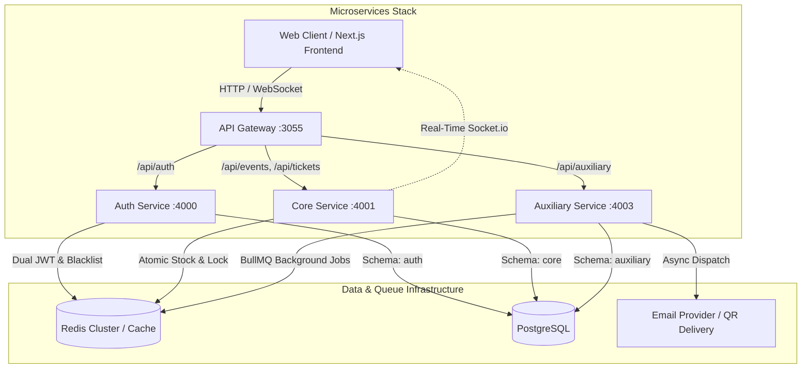

# 🎟️ PartyHub — Distributed Microservices Event Management & Ticketing Platform

[](https://nodejs.org/)
[](https://nextjs.org/)
[](https://www.docker.com/)
[](https://www.postgresql.org/)
[](https://redis.io/)
[](LICENSE)

A production-grade, event-driven microservices ecosystem built for large-scale event organization, concurrency-safe ticket reservations, QR code delivery, and real-time synchronization.

---

## 🏛️ System Architecture



---

## 📦 Services Breakdown

| Service | Technology | Port | Responsibilities |
| :--- | :--- | :--- | :--- |
| **API Gateway** | Express, `http-proxy-middleware`, Helmet, Rate-Limit | `3055` (`3000` internal) | Single entry point, reverse proxy routing, DoS/rate-limiting protection, security headers, fault-tolerant proxy fallbacks (503 on downstream outage). |
| **Auth Service** | Node.js, Express, Prisma ORM, Bcrypt, JWT | `4000` | User authentication, role-based access control, dual JWT token architecture (Access + Refresh tokens), Redis-backed token revocation / blacklisting on logout. |
| **Core Service** | Node.js, Express, Prisma ORM, Socket.io, Redis | `4001` | Core business logic, event creation, batch/quota management, atomic ticket reservations, high-concurrency race condition prevention, real-time WebSocket state broadcasts. |
| **Auxiliary Service** | Node.js, Express, BullMQ, Redis, Nodemailer, QRCode | `4003` | Asynchronous task processing, BullMQ job queues, transactional email delivery, QR code payload generation for entrance validation. |
| **Frontend** | Next.js 14 (App Router), TypeScript, Tailwind CSS, SWR | `3000` | Responsive web application, seller dashboard, live stock tracker, QR check-in terminal. |

---

## ✨ Key Engineering Highlights

### 1. High-Concurrency Ticket Reservation & Overselling Prevention
- **Challenge**: Multiple sellers and attendees purchasing the last remaining tickets simultaneously can cause race conditions and overselling.
- **Solution**: High-performance inventory checks with Redis atomic operations and database transactions, backed by extensive stress tests and chaos simulation scripts (`scripts/massive-attack.js`, `scripts/chaos-test.js`).

### 2. Event-Driven Asynchronous Processing
- **Decoupled Workloads**: Heavy I/O operations (QR generation, dynamic ticket rendering, SMTP dispatch) are offloaded to **BullMQ** job queues on **Redis**, preventing latency spikes on checkout requests.
- **Retry & Dead-Letter Handling**: Configured job backoff strategies and failure handling for reliable email delivery.

### 3. Dual JWT Auth & Immediate Token Revocation
- **Stateless Verification + Stateful Invalidation**: Access Tokens (short-lived, 15 min) are verified statelessly by the gateway and downstream services. Refresh tokens (7 days) are tracked with a Redis blacklist with TTLs to ensure instant revocation on logout.

### 4. Resilient Reverse Proxy & Graceful Degradation
- **Gateway Fault Tolerance**: Custom `onError` interceptors prevent unhandled promise rejections if internal microservices restart, responding with structured `503 Service Unavailable` error envelopes.

### 5. Multi-Stage Docker Builds & Rootless Security
- Production images use **Node.js Alpine** multi-stage builds, stripping build dependencies to minimize image sizes by over 50% and executing under non-root `USER node` privileges.

---

## 🚀 Quick Start (Local Setup)

### Prerequisites
- [Docker](https://docs.docker.com/get-docker/) and [Docker Compose](https://docs.docker.com/compose/) installed
- [Node.js](https://nodejs.org/) v18+ (for local testing/scripting)

### 1. Clone & Configure Environment Variables
```bash
git clone https://github.com/Stefanopellegrinoo/partyHub_microservicios.git
cd partyHub_microservicios

# Copy environment variable templates
cp api-gateway/.env.example api-gateway/.env
cp auth-service/.env.example auth-service/.env
cp core-service/.env.example core-service/.env
cp auxiliary-service/.env.example auxiliary-service/.env
cp partyHub-vercel/.env.example partyHub-vercel/.env.local
```

> **Note**: Fill in your own database credentials and JWT secrets inside each `.env` file before starting.

### 2. Launch with Docker Compose
```bash
# Start all microservices, Redis, and PostgreSQL
docker-compose up --build -d
```

### 3. Run Database Migrations
```bash
# Run Prisma migrations for each schema
cd auth-service && npx prisma migrate deploy && cd ..
cd core-service && npx prisma migrate deploy && cd ..
cd auxiliary-service && npx prisma migrate deploy && cd ..
```

---

## 🧪 Testing & Load Simulation

The repository includes a comprehensive testing suite and load-testing scripts to validate concurrency and resilience under extreme traffic:

```bash
# Run unit & integration tests
npm test

# Run concurrency and stress simulation scripts
node scripts/stress-test.js
node scripts/chaos-test.js
```

---

## 📂 Project Structure

```
partyHub_microservicios/
├── api-gateway/            # Unified reverse proxy & rate limiting
├── auth-service/           # Identity, JWT & token blacklist service
├── core-service/           # Events, tickets, tandas & real-time WebSockets
├── auxiliary-service/      # BullMQ workers, QR generation & email dispatch
├── partyHub-vercel/        # Next.js 14 frontend application
├── scripts/                # Stress tests, chaos attacks & load simulations
├── tests/                  # Integration & unit test suites (Vitest)
├── docs/                   # Architecture documentation & design notes
├── docker-compose.yml      # Multi-service container orchestration
└── README.md
```

---

## 📄 License
This project is open source and available under the [MIT License](LICENSE).
